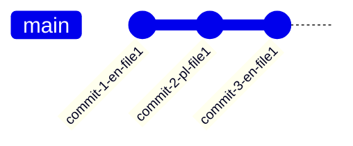
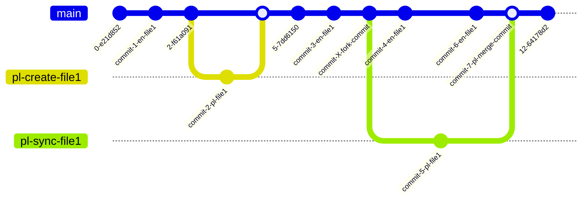
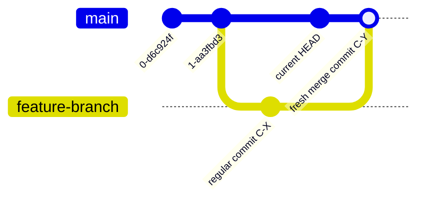

# what is it

**go-kweb-lang** was my private tool that helped me keep the translation content for the [kubernetes/website](https://github.com/kubernetes/website) project up to date, specifically for the *language directory* `content/pl` compared to the *original* in `content/en`. this tool helped me effectively detect files requiring updates, so I generalized it to work for all languages and made the project public so that everyone contributing to the *kubernetes/website* project could benefit from it.

**go-kweb-lang** is a tool written in pure *go*, designed to assist teams creating and maintaining translations for the *kubernetes/website* project. this tool provides a live dashboard showing which *language files* need to be updated and exactly what updates have occurred in the original content since the last version of the *language file*. an *update* is defined as one or more commits made after the last modification date of the *language file*. this tool also provides convenient *update* links to the GitHub repository pages, allowing you to easily view detailed information about the changes in commits and related pull requests.

**go-kweb-lang** helps best when you keep your translation files structure aligned with the *original* file structure. I keep the original formatting, comments, and everything else to ensure synchronization by line numbers between the *original* and *translation* files. thanks to this, when you see update commit, you only need the diff view to know exactly where to make the update. for example: PR [42502](https://github.com/kubernetes/website/pull/42502/files) for the *original* file and synchronization PR [50332](https://github.com/kubernetes/website/pull/50332/files) for the *translation*.
this tool detects updates by analyzing the change history of files primarily based on dates. it does NOT analyze file content. therefore, you should avoid partial synchronization updates and always commit fully up-to-date files.

the running tool is available at: https://go-kweb-lang.smallforge.dev, and its data is refreshed every 1 minute.

### main features

- detects changed files with a detailed list of updates
- detects files that existed but have been removed from the `content/en` directory
- matches submitted pull requests with the `language/{lang_code}` label to the relevant files
- continuously refreshes data (every 1 minute)

# how it works

**go-kweb-lang** downloads its own copy of the [https://github.com/kubernetes/website](https://github.com/kubernetes/website) repository and uses the `git` tool to analyze the change history in this repository.

the assumption of the *kubernetes/website* project is that all content is added only to the `content/en` directory, which should be the single source of truth. all *language files* (that is, all `content/{lang_code}` directories for every `lang_code` other than `en`) should follow the content from the *original* `content/en` directory.

let’s assume we have the file `content/en/file1.md` - in the rest of this document, we will refer to it as the *original file*. let’s also assume we created a translation in the file `content/pl/file1.md` - we will refer to it as the *translation file* or *language file*. in this case, `pl` is the language code.

now, let’s say that after some time, two new changes were made to the `en` file. as members of the translation teams, we want to receive information about which file needs to be updated and what specific updates have occurred so that we can easily and precisely determine which parts of the file have changed and which parts need to be updated.

in this case, we should receive information that `file1.md` has changed, along with a list of the two specific commits to `content/en/file1.md` that happened after the last modification date of the `file1.md` file in the `content/pl` directory.

**go-kweb-lang** checks the last modification date of the *language file* and then uses the `git` tool to analyze the commit history of the corresponding *original file* for any commits made after the last update date of the *language file*.

if there are any commits for the *original file*, it means (in most cases) that these changes should be applied to the *language file*. as a result, we obtain information indicating that a particular file requires an update, along with the specific commits that were made to the *original file*.

to make it easier to review what changes have occurred, the detected updates include links to the corresponding commits in the GitHub repository, making it very convenient to inspect the changes.

this process is performed for every language file in the `content/{lang_code}` directory, and the results are presented in a dashboard that shows information about all files that need updates or have an open and related pull request.

every 1 minute, GitHub is queried to check if any changes have occurred. if changes are detected, fresh data is fetched into the local repository, new commits are analyzed, and the data is recalculated.

since checking the file history is performed using the `git` tool - which is a time-consuming and resource-intensive operation - an internal cache is used to store the latest results.

### pull requests

if there is a PR for a language file with the `language/{lang_code}` label, it will be included in the dashboard table.

### false positives, comparing only dates in git, not nontent

this tool detects updates by analyzing the change history of files primarily based on dates. it does NOT analyze file content.

There may be cases of false positive update detections in several scenarios:

1. if the update to *the original file* fixes a language error in english that does not exist in the *language files*. although an update was made to the original file after the last modification date of the *language file*, there is actually nothing to update in the *language file* because the change only affected the *original language*. from a technical point of view, an update was made, but there is nothing meaningful to update. for example: https://github.com/kubernetes/website/commit/9693458ae21b1a683d38ed35f1f327ba6cfc229c .

2. if subsequent updates to the *original file* were made during the translation process - that is, in the period between the fork commit and the merge commit of the *language file*. the status of such a change is indeterminate: it is impossible to clearly determine based on dates alone whether *the language translation* already includes these *new changes* or not.

# how it works - more details

*language files* are usually created and modified in pull request, which means they are handled using branches. as a result, each *language file* has three *timestamps* that define its place in the history:

- the point where the branch is forked (branch creation)
- the point of the last commit in the branch for the *language file*
- the point where the merge commit happens

because creating a new file or updating existing one, going through the review process, and getting approval can take a long time, these three points can be spread far apart in time - sometimes even by several months.

in the ideal scenario, the *original file* is first updated, then the corresponding update for *the language file* is created and committed, and only afterward does another update to the *original file* happen. it doesn’t matter whether these updates are done in branches or directly on the main branch. a simplified sequence looks like this:



sometimes, however, the next update to *the original file* is made while *the language update* is still being created, or after it has been created but before it has been merged.

in the graph below, we see the branch `pl-sync-file1` where commit `commit-5-pl-file1` is created to update the language file `content/pl/file1`. during the lifetime of the `pl-sync-file1` branch, two new updates, `commit-4-en-file1` and `commit-6-en-file1`, are made to the original file `content/en/file1`.



in such a case, we can ask which date should be chosen as the starting point for detecting updates.

to choose the 'safest point' and ensure that no updates are missed, this tool uses the branch creation point. this may sometimes cause *false positives*, but it guarantees that no update is ever skipped.

to make it easier to identify *false positives* in cases of overlapping updates, the results are divided into groups. these groups are defined by the key timestamps of *the langauge file*:
- the date of the last commit
- the dates of the fork commit
- and the merge commit for the branch where the last change was made

this mechanism works correctly both when a commit is made directly to the main branch and when it is made in a separate branch. if the commit is made directly to main (not in a branch), there is no fork commit point. in that case, the last commit point is used instead.

# special cases

### excluded files

the file `OWNERS` is excluded from update checks because checking it does not make sense.

### deleted files

if there is a *language file* translating an *original file* that once existed but no longer does, such a file will also appear on the dashboard and will be marked as `en-file-no-longer-exists`. for such a file, the update will be the commit that deleted the original file. in some cases, the date of this commit may even be earlier than the last modification date of the *language file*.

# data refreshing

### triggering an update

**go-kweb-lang** can periodically query GitHub to check if any changes have occurred. it checks whether at least one of the following two conditions is met:

- a new `last commit` has appeared on the `main` branch
- there has been a change in the modification date of the latest pull request with the language label `language/{lang_code}`

### updating the repository and invalidating the internal cache

since checking and analyzing history is done using `git` commands, which are time-consuming for such a large number of files, an internal cache is used to store file data. subsequent queries for file information do not trigger a new sequence of `git` commands but instead retrieve data from the internal cache, unless the tool determines that the information needs to be refreshed. determining which files require refreshing is done during the process of updating the local copy of the *kubernetes/website* repository.

first, a `git fetch` is performed, and then each new commit is checked. for each new commit, the list of files affected by that commit is determined.

- if the commit includes a file from *a language directory* `content/{lang_code}` (but not from the original, i.e., not `content/en`), the cache is invalidated only for that specific file. for example, if a new commit affects the file `content/pl/file1.md`, then that file will be removed from the internal cache.

- if the commit includes a file from *the original directory* (`content/en`), it will be removed from the cache, but in addition, all corresponding language files for all currently fetched languages will also be invalidated. for example, if we have the languages `de`, `fr`, and `pl`, and the new commit includes the file `content/en/file1.md`, then the cache will be invalidated for `content/en/file1.md` as well as for all existing corresponding language files: `content/de/file1.md`, `content/fr/file1.md`, and `content/pl/file1.md`.

when all new commits have been processed, the HEAD of the `main` branch is updated by performing a `git pull`.

### case when the new commit is a merge commit of an earlier commit

if commit C-X was created earlier than the current HEAD, but after performing `git fetch` we have a new commit C-Y that is a merge commit for a branch containing commit C-X, then all files from commit C-X will also be considered during the cache invalidation process. this applies to both *language files* and *original files*.



### updating the list of pull requests

if a change is detected in the pull requests for a given language, i.e., with the `language/{lang_code}` label, the list of all current pull requests for that language is fetched. to minimize the number of calls to the GitHub API, an internal cache is used for pull request data. if the last modification date has not changed, the data is retrieved from the internal cache.

each pull request can have multiple commits, and each commit can affect multiple files. after collecting all the data, a reverse mapping is created - from file to the list of pull requests affecting it. this allows the dashboard to match existing open pull requests to each file, if any exist.

# dashboard

the entire frontend part of this tool consists of only two pages:
- a page with a list of language codes (only those explicitly specified, if any were provided)
- a dashboard page for a specific language

the dashboard page mainly consists of a single table with the following columns:

**Lang Relative Path** - the relative path to the file, starting from the directory of the given language, i.e., `content/{lang_code}`. in addition to the path, key timestamps are shown: the date of the last commit and, if the commit was made in a separate branch, the dates of the branch creation (fork) and the merge into main. these timestamps can often be spread weeks or even months apart. these dates are especially important if updates to the original file were made during the lifetime of such a branch. in other words, if subsequent updates to the original overlap with the language branch

to the right of the file’s relative path, there is a `#` link that renders the dashboard only for this specific file. such a link can be useful if you want to share information about a single specific file with someone.

**Status** - the status of the language file compared to the original file:

- **en-file-updated** - *the original file* has been modified and has at least one update.
- **en-file-does-not-exist** - *the language file* has no corresponding file in the `content/en` directory.
- **en-file-no-longer-exists** - *the language file* exists, but *the original file* once existed and has since been deleted. in the updates list, there will be a commit removing this file.
- **waiting-for-review** - *the language file* has not yet been merged into the main branch and is waiting for review.
- *(no status)* - none of the above situations apply. the file may still appear on the dashboard if there is an open PR associated with it.

**EN Updates** - the list of *updates* to the corresponding *original file* that were made after the last modification date of *the language file*. to make it easier to analyze changes (especially in the case of false positives), *updates* are grouped by the key timestamps of *the language file* (fork commit date, last commit date, merge commit date). in a special case, if *the original file* existed but has since been deleted, the date of the commit that deleted it may even be earlier than the fork commit of the language file. if *the update* was made in a separate branch, both the commit introducing the change and the merge commit that merged it are shown. this can be very useful if the commit and merge commit are far apart in time.

**PR** - the list of pull requests related to this file that have the `language/{lang_code}` label.

# running

the following decisions need to be made when running this tool:
- where the working directory for the *kubernetes/website* repository will be located
- where the cache directory will be located
- which languages you want to monitor
- whether you want to use GitHub token to increase the API access limit, or you want to completely skip fetching PRs 

if these are not specified, default parameters will be used. both directories will be created in the current working directory. if languages are not explicitly specified, data will be generated for all available languages. since calculating data for all languages can take a long time, it is recommended to specify only the language you need.

additionally, you can provide a GitHub personal access token to use higher rate limits for the GitHub API.

you can see the running application with all languages at: https://go-kweb-lang.smallforge.dev .

### building

```bash
git clone https://github.com/dkarczmarski/go-kweb-lang
cd go-kweb-lang
go build -o go-kweb-lang ./cmd
```

### parameters

- the environment variable `CACHE_DIR` or the argument `-cache-dir` specifies the directory for the internal cache. the default value is `./.appdata/cache`.
- the environment variable `REPO_DIR` or the argument `-repo-dir` specifies the directory where the git clone will be created. the default value is `./.appdata/kubernetes-website`.
- the environment variable `GITHUB_TOKEN` or the argument `-github-token` specifies the string with the GitHub personal access token.
- the environment variable `GITHUB_TOKEN_FILE` or the argument `-github-token-file` specifies the file containing the GitHub personal access token. the default value is `.github-token.txt` and that file does not have to exist.
- the environment variable `LANG_CODES` or the argument `-lang-codes` specifies the language code for which the dashboard should be generated; multiple values can be provided, separated by commas.
- the environment variable `WEB_HTTP_ADDR` or the argument `-web-http-addr` specifies the TCP address for the server to listen on. the default value is `:8080`.
- the argument `-run-once` specifies that the data should be refreshed only once at application startup before the web server starts.
- the argument `-run-interval` specifies the number of minutes between each data refresh.
- the argument `-no-web` disables the web server.
- the argument `-skip-git` disables checking the git repository.
- the argument `-skip-pr` disables pull request checking. it might be handy when you don't provide a GitHub access token.

### usage examples

by default, the web server starts on port 8080. 

the easiest way is to run only for your language (for example `pl`), calculate dashboard data once at startup, and skip PR checking when you don't provide a GitHub API token:

```
go-kweb-lang -lang-codes=pl -run-once -skip-pr
```

run for the `pl` and `de` languages, refresh data every 1 minute, and use a token from the `.github-token.txt` file to communicate with the GitHub API:

```
go-kweb-lang -lang-codes=de,pl -run-interval=1 -github-token-file=.github-token.txt
```

# contribution

this is an alpha version. you can open an issue to request changes or new features. you can also open a pull request.
